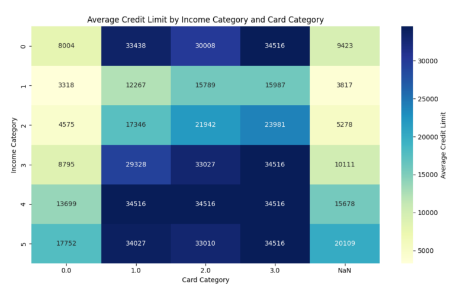
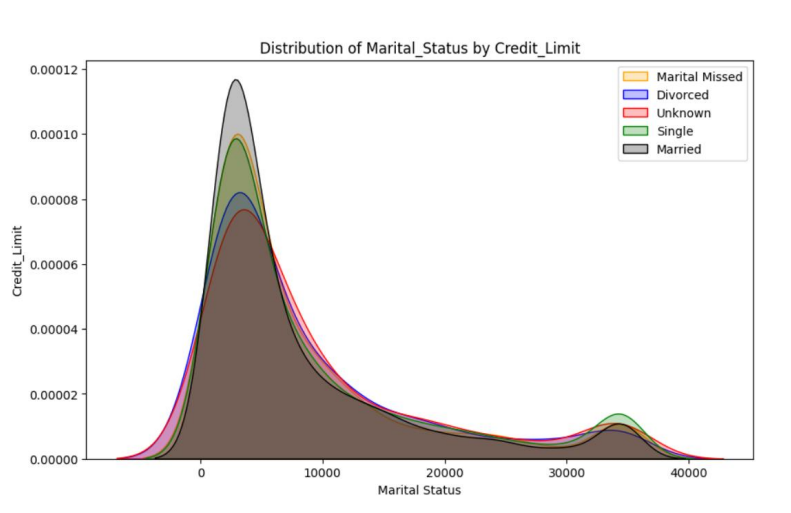
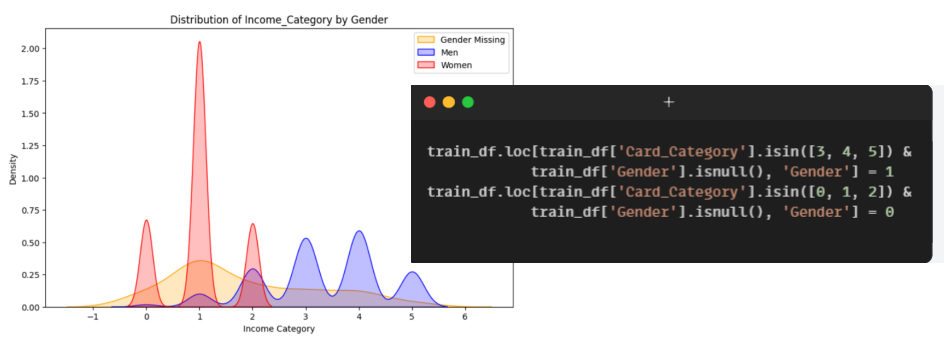
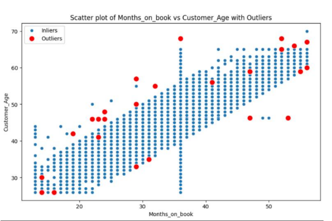
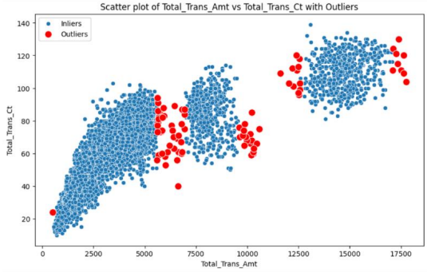
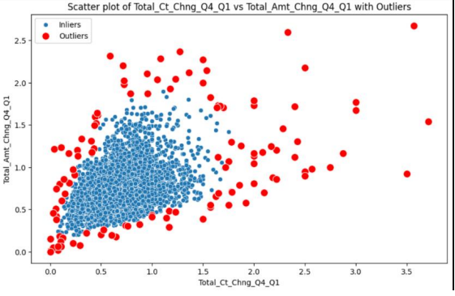
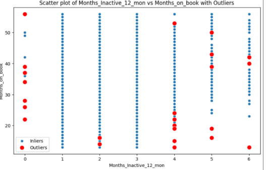
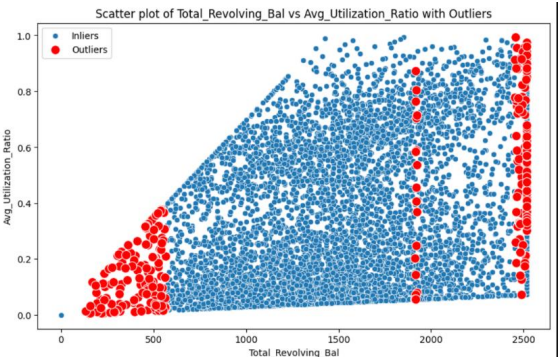

# Credit Limit Prediction using Regression
Predicting credit limits is crucial for financial institutions to assess risk and make informed lending decisions. This project focuses on using regression models to predict credit limits based on various customer attributes.

## Preprocessing Data
Before training our model, we preprocess the data to ensure its quality and suitability for analysis. This includes removing irrelevant columns, handling duplicate data, encoding categorical features, and splitting the data into training and testing sets.

## Handling Missing Data
Missing data is a common issue in datasets and can significantly impact model performance. We employ strategies such as imputation based on mean or median values and leveraging relationships between features to fill missing data appropriately.

<table>
  <tr>
    <td align="center"></td>
    <td align="center"></td>
  </tr>
</table>

## Handling Outliers
Outliers can skew model predictions and affect the overall accuracy. We identify and remove outliers using techniques like Local Outlier Factor (LOF) to ensure robust model training.

<table>
  <tr>
    <td align="center"></td>
    <td align="center"></td>
  </tr>
  <tr>
    <td align="center"></td>
    <td align="center"></td>
  </tr>
  <tr>
    <td align="center"></td>
    <td align="center"></td>
  </tr>
</table>

## Feature Selection
Selecting the most relevant features is crucial for model efficiency and interpretability. We use techniques like correlation analysis and feature importance scores to select the most informative features for our regression model.

|     | Feature                   | Importance | VIF      |
| --- | ------------------------- | ---------- | -------- |
| 0   | Avg_Utilization_Ratio     | 0.420781   | 6.062172 |
| 1   | Income_Category           | 0.239581   | 8.630447 |
| 2   | Total_Revolving_Bal       | 0.163871   | 7.174995 |
| 3   | Card_Category             | 0.061275   | 1.296993 |
| 4   | Total_Trans_Amt           | 0.016861   | 8.821232 |
| 5   | Total_Amt_Chng_Q4_Q1     | 0.015222   | 16.236073|
| 6   | Total_Ct_Chng_Q4_Q1      | 0.014307   | 15.424124|
| 7   | Total_Trans_Ct            | 0.012174   | 25.031854|
| 8   | Customer_Age              | 0.010757   | 76.824692|
| 9   | Months_on_book            | 0.010366   | 57.213571|
| 10  | Total_Relationship_Count  | 0.007021   | 7.831607 |
| 11  | Education_Level           | 0.006195   | 3.251686 |
| 12  | Contacts_Count_12_mon     | 0.005856   | 5.587047 |
| 13  | Dependent_count           | 0.004754   | 4.209314 |
| 14  | Months_Inactive_12_mon    | 0.004551   | 6.314962 |
| 15  | Marital_Status            | 0.004440   | 8.258021 |
| 16  | Gender                    | 0.001987   | 4.977622 |

## Model Training
We train regression models, such as RandomForestRegressor, on the preprocessed data to predict credit limits. We fine-tune model parameters and evaluate performance to ensure optimal results.

## Evaluation
We evaluate model performance using metrics such as Mean Squared Error (MSE) and R-squared. Additionally, we assess model stability through cross-validation and compare results across multiple runs.

## Conclusion
In conclusion, this project demonstrates the application of regression models for credit limit prediction. By preprocessing data, handling missing values and outliers, and selecting informative features, we build robust models that can assist financial institutions in making informed lending decisions.

## Contributing
Contributions to this project are welcome! If you have any suggestions, improvements, or bug fixes, feel free to open an issue or submit a pull request.
